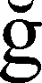
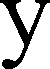

# OAVI_lab7
_Распознавание текста по признакам_

### Вариант 18

**Турецкие строчные буквы**

Была поставлена следующая задача:

1. Реализовать расчёт меры близости изображений символов на основе признаков:
   - Масса (нормализованная площадь)
   - Координаты центра тяжести
   - Осевые моменты инерции
   - Использовать евклидово расстояние в n-мерном пространстве

2. Для каждого символа рассчитать меру близости со всеми символами алфавита
3. Вывести результаты в файл с сортировкой гипотез по убыванию меры близости
4. Провести эксперимент с разными размерами шрифта и сравнить результаты

***

## Функции

Основные функции находятся в файле `classification.py`.

### classification.py

- `binImg(filename: str, resultFilename: str) -> None`
    > Преобразует изображение в монохромное с обрезкой лишних полей
    >
    > _ПАРАМЕТРЫ:_  
    >    * **filename** - Путь к исходному изображению  
    >    * **resultFilename** - Путь для сохранения результата  

- `profiles(filename: str) -> tuple`
    > Вычисляет горизонтальный и вертикальный профили изображения
    >
    > _ПАРАМЕТРЫ:_  
    >    * **filename** - Путь к изображению  
    >
    > _ВОЗВРАЩАЕТ:_  
    >    * Кортеж (горизонтальный профиль, вертикальный профиль)

- `segmentation(filename: str, hProfile: list, vProfile: list) -> list`
    > Сегментирует текст на изображении на отдельные символы
    >
    > _ПАРАМЕТРЫ:_  
    >    * **filename** - Путь к изображению  
    >    * **hProfile** - Горизонтальный профиль  
    >    * **vProfile** - Вертикальный профиль  
    >
    > _ВОЗВРАЩАЕТ:_  
    >    * Список координат прямоугольников символов (x1, y1, x2, y2)

- `features(img: Image) -> list`
    > Вычисляет признаки символа:
    > 1. Нормализованная масса
    > 2. Нормированные координаты центра X
    > 3. Нормированные координаты центра Y
    > 4. Нормированный осевой момент X
    > 5. Нормированный осевой момент Y
    > 6. Нормированный центробежный момент
    >
    > _ПАРАМЕТРЫ:_  
    >    * **img** - Изображение символа (PIL.Image)  
    >
    > _ВОЗВРАЩАЕТ:_  
    >    * Список из 6 признаков

- `letFromImg(binFilename: str, charBoxes: list) -> list`
    > Вырезает символы по координатам и сохраняет их
    >
    > _ПАРАМЕТРЫ:_  
    >    * **binFilename** - Путь к бинаризованному изображению  
    >    * **charBoxes** - Координаты символов  
    >
    > _ВОЗВРАЩАЕТ:_  
    >    * Список изображений символов

- `eucliDistance(f1: list, f2: list) -> float`
    > Вычисляет евклидово расстояние между признаками
    >
    > _ПАРАМЕТРЫ:_  
    >    * **f1** - Признаки первого символа  
    >    * **f2** - Признаки второго символа  
    >
    > _ВОЗВРАЩАЕТ:_  
    >    * Евклидово расстояние

- `generate_text_image(text: str, font_size: int, output_filename: str) -> str`
    > Генерирует изображение текста заданным шрифтом
    >
    > _ПАРАМЕТРЫ:_  
    >    * **text** - Текст для генерации  
    >    * **font_size** - Размер шрифта  
    >    * **output_filename** - Путь для сохранения  
    >
    > _ВОЗВРАЩАЕТ:_  
    >    * Путь к сохраненному изображению

- `classification(binFilename: str, etalonFeatures: dict, reference: str) -> None`
    > Основная функция классификации символов
    >
    > _ПАРАМЕТРЫ:_  
    >    * **binFilename** - Путь к бинаризованному изображению  
    >    * **etalonFeatures** - Словарь эталонных признаков  
    >    * **reference** - Эталонная строка для сравнения  
    >
    > _РЕЗУЛЬТАТ:_  
    >    * Сохраняет результаты распознавания в файл

---

# Работа программы

## Входные данные
- Алфавит: `abcçdefgğhijklmnoöprsştuüvyz`
- Эталонная фраза: `sana olan hislerim asla değişmeyecek`
- Пример входного изображения:

## Результаты работы

### Сегментированный текст

### Примеры сегментированных символов
<table>
  <tr>
    <td></td>
    <td></td>
    <td></td>
    <td></td>
    <td></td>
  </tr>
</table>

### Результаты распознавания
Распознанная строка: sanaolanhislerimasladeğişmeyecek  
Эталонная строка: sanaolanhislerimasladeğişmeyecek  
Ошибок: 0, Точность: 100.00%

## Эксперимент с размерами шрифта
Исходный размер: 52pt, Новый размер: 32pt

Распознанная строка: vvvvvtvvvyvtvvyvvvvtvvvvyvvvvvvvvv  
Эталонная строка: sanaolanhislerimasladeğişmeyecek  
Ошибок: 32, Точность: 0.00%

Вывод: при уменьшении размера шрифта точность распознавания значительно снижается